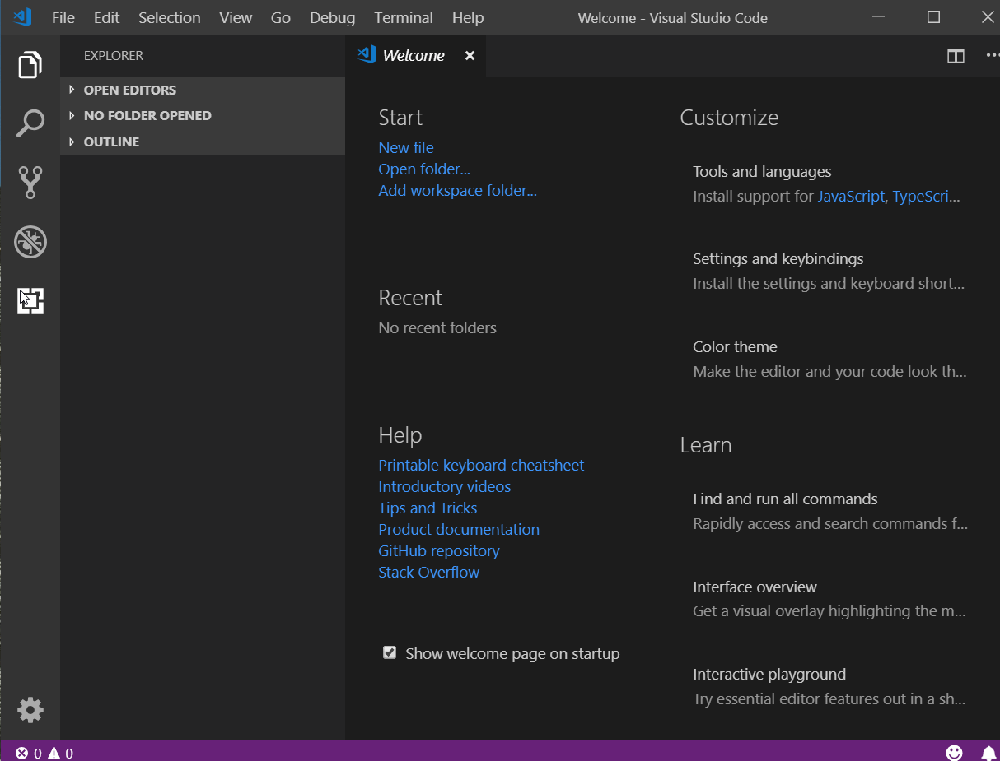

# golang人生初见

## 1、安装
golang安装十分简单，和java类似，安装之后需要配置环境变量。去[官网](https://golang.google.cn/dl/)下载安装包，点击运行，选择安装目录，然后基本就一路下一步直到完成。然后将安装目录添加到环境变量path当中，配置GOPATH路径，整个安装就完成了。打开命令行输入：
``` bash
go version
```
输出版本号就说明安装成功了。

## 2、开发环境
* 1、[下载 vscode](https://code.visualstudio.com/)并安装

* 2、然后安装中文包

* 3、再用同样的方法安装go查询件

### 安装golang必要工具
由于golang工具都在国外，因此安装时几乎很难成功，所以需要配置代理，[大神代理](https://goproxy.io/zh/)配置十分简单
* Bash (Linux or macOS)
``` bash
# 配置 GOPROXY 环境变量
export GOPROXY=https://goproxy.io,direct
# 还可以设置不走 proxy 的私有仓库或组，多个用逗号相隔（可选）
export GOPRIVATE=git.mycompany.com,github.com/my/private
``` 
* PowerShell (Windows)
```powershell
# 配置 GOPROXY 环境变量
$env:GOPROXY = "https://goproxy.io,direct"
# 还可以设置不走 proxy 的私有仓库或组，多个用逗号相隔（可选）
$env:GOPRIVATE = "git.mycompany.com,github.com/my/private"
```

### 配置go mod
go mod是golang新的包管理器，用以替代以前的包管理方式,配置方式十分简单：

``` powershell
go env -w GO111MODULE=on
go env -w GOPROXY=https://goproxy.cn,https://goproxy.io,direct
```
!> 至此，golang的开发环境搭建就此完成了！

## 3、go之初体验
* 在任意路径新建一个文件夹，命名为go，用vscode打开它，按ctrl+`打开终端，在终端中输入命令：
``` powershell
go mod init golang  # golang是模块名称
```
然后可以看到文件夹中多了一个文件go.mod，打开它可以看到我们定义的模块名称和golang版本号,这就是用来管理我们golang程序依赖的文件，当我们使用`go get`命令安装第三方包时，这个文件还会有其他内容。

* 好了，新建一个`main.go`文件，开始体验golang吧:
  ``` go
    package main

    import "fmt"

    var f string

    func main() {
        f = "world!"
        ss := "golang 初体验"
        fmt.Printf("Hello %s \r\n%s", f, ss)
    }
  ```

在终端输入命令：`go run main.go` 输出：
``` bash
Hello world!
golang 初体验
```


