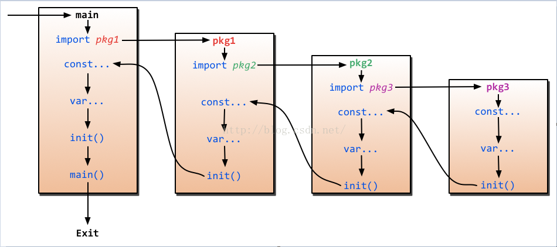

# 函数

## 1、基础
go语言函数有一下特点：
* 多返回值：go语言支持多返回值
* 具名的返回参数：go语言能定义返回值参数,且存在具名返回值时，`return`可不指定返回变量，编译器会替我们完成
* `return`非原子性：`return`实际是先给返回参数赋值，然后在返回，因此`defer`函数能够修改返回值
* 下划线显示抛弃：如果我们不关心或者不需要某个返回值，go语言要求必须使用下划线显式抛弃
* 值传递：go语言参数是按值传递的，修改实参不会影响调用方数据；指针、slice、map、channel、函数是应用类型，是按应用传递的，实际传递的是对象的地址。
* 可变参数：go语言支持可变参数类型，可变参数以`...`定义。每个函数有且只能有一个可变参数，且必须是最后一个参数。
* 函数类型：函数本身也是一种类型
* 匿名、闭包：支持匿名函数和闭包
* 其他语言实现：go语言支持仅声明，然后使用其他语言实现

!> go语言函数不支持重载，同一个包只能存在一个同名函数

!> 函数命名以小写开头的函数只能在当前包中访问，大写开头的才能在包外访问

### 函数声明
```
func 函数名(参数列表)(返回值列表){
    函数体
}
```
* 参数列表中，连续的同类型的参数，其类型可合并声明：
```go
func sub(x, y int, s string) (int, string) {
    // 类型相同的相邻参数，参数类型可合并。 多返回值必须用括号。
    n := x + y          
    return n, s
}
```

```go

// 普通方式
func fn(a int, b int) int {
	return a + b
}

// 相同类型的参数，合并声明
func fn2(a, b int) (result int) {
	result = a + b
	return result
}

// 具名返回值，return可不指定返回变量，编译器会帮我们处理
func fn3(a, b int, msg string) (result int, err error) {
	if a < 0 {
		err = errors.New(msg)
	}
	result = a + b
	return
}

// 无具名的多返回值函数
func fn4(a, b int, msg string) (int, error) {
	var err error
	if a < 0 {
		err = errors.New(msg)
	}
	result := a + b
	return result, err
}

// 变长参数
func fn5(a ...int) (int, error) {
	var err error
	var result int
	for _, i := range a {
		if i < 0 {
			err = errors.New("小于零")
		}
		if result+i > math.MaxInt32 {
			err = errors.New("溢出")
		}

		result += i
	}

	return result, err
}
```
!> 变长参数，本身就是一个`slice`，所以可以直接传入一个`slice`,不过需要在变量后面使用操作符`...`

```go
func main() {
	a := []int{1, 2, 3}
	fn5(a...) // 传入slice
	fn5(5, 6, 7, 8, 9, 10, 11, 12, 13, 14, 15)
}
// 变长参数
func fn5(a ...int) (int, error) {
	var err error
	var result int
	for _, i := range a {
		if i < 0 {
			err = errors.New("小于零")
		}
		if result+i > math.MaxInt32 {
			err = errors.New("溢出")
		}

		result += i
	}

	return result, err
}
```

## 2、递归
函数自己调用自己就叫递归
> 许多编程语言使用固定长度的函数调用栈;大小在64KB到2MB之间。递归的深度会受限于固定长度的栈大小，所以当进行深度递归调用时必须谨防栈溢出。固定长度的栈甚至会造成一定的安全隐患。相比固定长的栈，Go语言的实现使用了可变长度的栈，栈的大小会随着使用而增长，可达到1GB左右的上限。这使得我们可以安全地使用递归而不用担心溢出问题。

计算斐波那契数列：
```go
var fibs [LIM]uint64

func Fib4(n int) (res uint64) {
	if fibs[n] != 0 {
		res = fibs[n]
		return
	}
	if n <= 1 {
		res = 1
	} else {
		res = Fib4(n-1) + Fib4(n-2)
	}
	fibs[n] = res
	return
}
```

## 3、main、init函数

#### main

与其他编译型语言一样，`main`函数是go程序的入口，`main`必须遵守一下规则：
* go程序有且只能有一个`main`函数
* `main`函数不能有参数，也不能有返回值，更不能被调用，go程序启动时会自动调用
* `main`函数执行前会先执行init函数
* `main`函数只能存在于main包之中，且必须包含一个`main`函数

#### init

init函数是go语言的保留函数，拥有一下特性：
* 没有返回值，也没有参数
* 每个包都可以有多个init函数，每个源码文件也可以有多个init函数
* init函数和main一样不能被程序调用，它在程序启动时自动被调用
* init函数会先于main函数执行

程序的初始化和执行都起始于main包。如果main包还导入了其它的包，那么就会在编译时将它们依次导入。有时一个包会被多个包同时导入，那么它只会被导入一次（例如很多包可能都会用到fmt包，但它只会被导入一次，因为没有必要导入多次）。当一个包被导入时，如果该包还导入了其它的包，那么会先将其它包导入进来，然后再对这些包中的包级常量和变量进行初始化，接着执行init函数（如果有的话），依次类推。等所有被导入的包都加载完毕了，就会开始对main包中的包级常量和变量进行初始化，然后执行main包中的init函数（如果存在的话），最后执行main函数：



!> 虽然go语言允许在一个包里定义任意多个`init`函数，但这无论是对于可读性还是可维护性来说都是一个麻烦，甚至是灾难，因此在一个`package`中只写一个`init`函数，就和`main`函数一样

## 4、匿名函数

匿名函数：即在定义函数的时候可以不用给函数定义名称，匿名函数可以像变量一样使用，用于参数传递。

```go
package main

import (
	"fmt"
	"strings"
)

func main() {
	s := strings.Map(func(r rune) rune {
		return r + 1
	}, "golang")

	fmt.Println(s)
}
```

匿名参数可以赋值给变量：

```go
package main

import (
	"fmt"
	"strings"
)

func main() {
	fn := func(a, b int) int {
		return a + b
	}

	a := fn

	fmt.Println("a:", a(1, 2))
	fmt.Println("fn:", fn(6, 2))
}
```

匿名函数也可以直接立即执行,能够直接计算出结果：

``` go 
package main

import (
	"fmt"
)

func main() {
	f := func(a, b int) int {
		return a + b
	}(4, 5)

	fmt.Printf("f:%v", f)
}
```
## 5、闭包
闭包由函数及其调用方上下文组成。
> 闭包包含自由（未绑定到特定对象）变量，这些变量不是在这个代码块内或者任何全局上下文中定义的，而是在定义代码块的环境中定义（局部变量）。“闭包” 一词来源于以下两者的结合：要执行的代码块（由于自由变量被包含在代码块中，这些自由变量以及它们引用的对象没有被释放）和为自由变量提供绑定的计算环境（作用域）。

* 延迟执行：闭包具备延迟执行的特点，因为闭包复制的是原对象指针

```go
func closure() func(x, y int) int {
	i := 0
	b := func(x, y int) int {
		i++
		result := x + y + i
		fmt.Println(result)
		return result
	}
	return b
}

func main() {
	c := closure()
	c(1, 2)
	c(3, 4)
	c(5, 6)

	closure()(7, 8)
}
```
输出：
``` bash
4
9
14
16
```
函数`closure`返回了一个函数，且`b`是一个闭包，因此`c`在执行的时候是会带上`b`的上下文的，即`c`也是可以访问`closure`的函数i的，因此`c`第一次执行时，`i`的为`0`，加`1`之后为`1`，最终结果为`4`；第二次执行时，`i`的值为`1`，加`1`之后为`2`，最后结果为`9`，第三次执行也是如此。最后一句代码`closure()(7, 8)`重新返回了一个函数，因此计算时`i`的值为`0`，最终结果为`16`

## 6、延迟函数

在许多场景下，我们需要在函数调用结束之前，去执行一些操作，比如关闭网络连接、关闭文件句柄等等。在C++、java、C#等语言中可以在finally语句块中去执行，finally语句块能保证其中的操作一定会执行，即便是出现异常也会执行。但是go语言没有C++、java、C#等语言的try...finally语法结构，在go语言中我们使用延迟函数，使用defer关键字来注册。

#### defer的特性:
 * 注册函数：关键字 defer 用于注册一个函数。
 * return之前调用：这些调用直到 return 前才被执。因此，可以用来做资源清理。
 * 先入后出：多个defer语句，按先进后出的方式执行。顺序等同于入栈出栈。
 * 变量声明：defer语句中的变量，在defer声明时就决定了。

#### 常用场景:
* 关闭文件句柄
* 锁资源释放
* 数据库连接释放
* 捕获异常

```go
package main

import (
	"fmt"
	"strings"
)

func main() {
	defer func() {
		fmt.Println("one")
	}()

	defer deferFunction()

	defer func() {
		fmt.Println("two")
	}()

	defer func() {
		fmt.Println("three")
	}()

	fmt.Println("main")
}

func deferFunction() {
	fmt.Println("deferFunction")
}
```

输出：

```
main
three
two
deferFunction
one
```
#### defer 闭包函数
看下面的代码：
```go
package main

import (
	"fmt"
	"strings"
)

func main() {
	a := []int{1, 2, 3, 4, 5, 6, 7}

	for _, i := range a {
		defer func() { fmt.Println(i) }()
	}
}
```
输出：
```bash
7
7
7
7
7
7
7
```
输出全都是7，而不是预期的1到7。原始是因为defer是延迟执行的，执行到for的时候defer函数并不会执行，但是for程序会继续执行，每次迭代i的值都会改变。那么当defer函数执行时，这时候i的值已经是7了，因而造成了上述现象。修复改问题也很简单，我们只需要把defer函数需要用到的参数传入函数体就可以了；或者重新定义一个参数，并将i的值复制给这个参数：

```go 
func main() {
	a := []int{1, 2, 3, 4, 5, 6, 7}

	for _, i := range a {
		b := i  // 重新定义一个参数
		defer func() { fmt.Println(b) }()
	}
}


func main() {
	a := []int{1, 2, 3, 4, 5, 6, 7}

	for _, i := range a {
		// 将参数传入闭包当中
		defer func(b int) { fmt.Println(b) }(i)
	}
}
```
以上两种方式的输出，都是我们预期的结果：
``` bash
7
6
5
4
3
2
1
```

#### defer与return

!> go语言的return语句与其他语言不同，go的return并不是原子性的。go语言会先将返回值赋值给返回值变量，然后再返回调用方。而defer会在return返回之前调用，因此defer函数可以修改返回变量的值，这在具名返回值中需要格外注意。

```go
func main() {
	a := add(3, 4)

	fmt.Println(a) // 100
}

func add(x, y int) (result int) {
	defer func() {
		result = 100
	}()

	result = x + y
	return result
}
```
程序最终输出：100

#### defer 与 error 
阅读如下代码：
```go
func div(a, b int) (i int, err error) {
	defer fmt.Printf("defer1 err： %v\n", err)
	defer func(err error) { fmt.Printf("defer2 err： %v\n", err) }(err)
	defer func() { fmt.Printf("defer3 err： %v\n", err) }()
	if b == 0 {
		err = errors.New("除数为0!")
		return
	}

	i = a / b
	return
}

func main() {
	div(2, 0)
}
```
输出：

```go 
defer3 err： 除数为0!
defer2 err： <nil>
defer1 err： <nil>
```
如果`defer`执行时，不是跟在最后的操作时, `defer`得到的并不是最新的值。上面的代码：
* `defer3`上一步操作是：`err = errors.New("除数为0!")`,`defer3`获取到的是`error.New`函数新返回的`err`对象。但是`defer2`和`defer1`得到的依旧是函数最初的`err`变量值，即`err`变量的初始值:`nil`。
* go语言函数参数传值是按值传递，并且`error`本身是个接口，接口是值类型，因而在`defer`函数中修改参数值不会影响原参数的值。

如果要将error传递下去，需要使用指针：
```go
func main() {
	div2(2, 0)
}

func div2(a, b int) (i int, err error) {
	defer func(err *error) { fmt.Printf("defer1 err： %v\n", *err) }(&err)
	defer func(err *error) { fmt.Printf("defer2 err： %v\n", *err) }(&err)
	defer func(err *error) { fmt.Printf("defer3 err： %v\n", (*err).Error()) }(&err)
	if b == 0 {
		err = errors.New("除数为0!")
		return
	}

	i = a / b
	return
}
```
输出：
```go
defer3 err： 除数为0!
defer2 err： 除数为0!
defer1 err： 除数为0!
```
