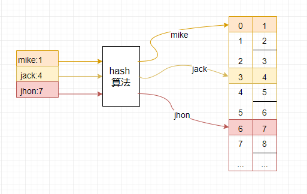
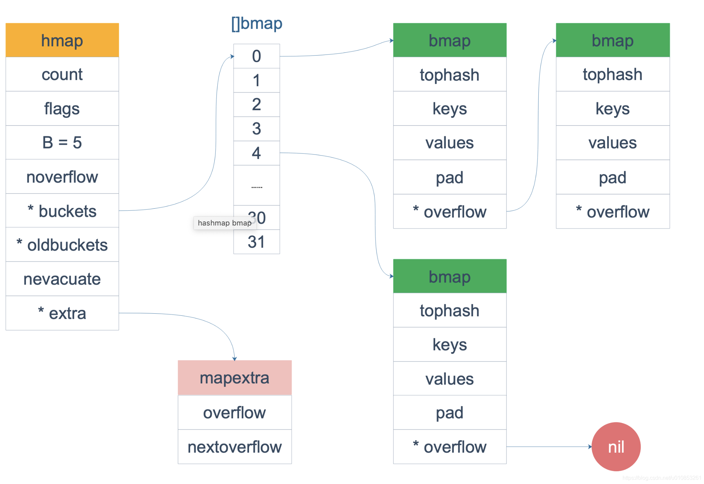

# 散列表
## 基础
> 散列表也叫哈希表、字典，是一种通过键值对来存储数据的集合。

* 引用类型：map是散列表的引用，本身是引用类型，必须初始化才能使用
* 键值对：map的类型是map[key]value,所有的key的类型相同，所有value的类型也相同
* 零值：初始化时会对map赋予零值；key不存在的时候也会返回零值，因此map总能取到值
  
### map定义

#### 1、字面量定义
语法：map[keyType]valueType
* keyType : 散列表键的类型
* valueType ：散列表值的类型
```go
	var m map[string]int
	b := map[string]int{
		"name": 20,
		"age":  13, // 逗号不可缺少
	}
```
!> 字面量设置初始化值的时候，最后一行的`，`不可缺少，否则会引发编译错误

#### 2、make函数
map 可以使用make函数定义：
```go 
	mm := make(map[string]int)
	mm2 := make(map[string]int, 10)
```

### 基本操作

``` go 
package main

import "fmt"

func main() {
	b := map[string]int{
		"name": 20,
		"age":  13,
	}
	// 遍历
	for key, value := range b {
		fmt.Println(key, value)
	}

	// 取值
	s := b["name"]
	fmt.Println("取值name:", s)

	// 设置值
	b["age"] = 500
	fmt.Println("取值age:", b["age"])

	// 添加key
	b["jack"] = 132
	fmt.Println("取值jack:", b["jack"])

	// 删除key
	fmt.Println("删除前长度", len(b))
	delete(b, "jack")
	fmt.Println("删除后长度", len(b))

	fmt.Println("-----删除后的内容---")
	for key, value := range b {
		fmt.Println(key, value)
	}
	fmt.Println("------------------")

}
```
输出：
```bash
name 20
age 13
取值name: 20
取值age: 500
取值jack: 132
删除前长度 3
删除后长度 2
-----删除后的内容---
name 20
age 500
------------------
```

### 判断key是否存在
go的map是引用类型，定义之后都会初始化。因此在取一个不存在的key的时候依旧会得到零值：
```go
func main() {
	m := make(map[string]int)
	fmt.Println(m["mike"]) // 输出0
}
```
因此，像java、C#等语言一样通过获取值来判断key是否存在是行不通的，go语言有其独特的方式：
```go 

func main() {
	m := make(map[string]int)
	if v, ok := m["mike"]; ok {
		fmt.Println(v)
	} else {
		fmt.Println("key 'mike' 不存在")
	}

}
```
输出：key 'mike' 不存在

### map的传递
```go
package main

import "fmt"

func main() {
	fmt.Println("--------------- map ---------------")
	m := make(map[string]string)
	m["1"] = "10"

	fmt.Printf("传递前地址： %p, m=%v \n", m, m)
	funcMap(m)
	fmt.Printf("传递后地址： %p, m=%v \n", m, m)
	fmt.Println("--------------- map ---------------")

}

func funcMap(m map[string]string) {
	fmt.Printf("传入的地址： %p \n", m)
	m["2"] = "222"
	fmt.Printf("传入后地址 %p \n", m)
}
```
输出：
```bash
--------------- map ---------------
传递前地址： 0xc0000723c0, m=map[1:10]
传入的地址： 0xc0000723c0
传入后地址 0xc0000723c0
传递后地址： 0xc0000723c0, m=map[1:10 2:222]
--------------- map ---------------
```
!> 从结果可以看出go语言的map是按引用传递的，其本身也是引用类型

## 2、map的实现原理
### 哈希
map的底层使用的是数组来存储数据的，map会将key通过哈希算法得出一个哈希值，这个哈希值在对数组长度求余得出的结果就是数组的下标，数据便会被存储到这个下标对应的数组位置上。



哈希算法：
* 将任意长度的输入计算为相同长度的输出的一种算法。
* 哈希敏感：哈希算法的输入值哪怕值更改一点点，其值也会有巨大变化。这个特性经常用于判断文件是否更新。
* 哈希碰撞：不同的输入可能会得到相同的值，即：hash(x)==hash(y)

### 哈希碰撞
 > 哈希碰撞就是不同的参数经过哈希函数计算之后得出了相同的值。

 解决哈希碰撞一般有下面几种方法：
 * 开放寻址法：在发生碰撞时，在数组的某个位置上发现已经有数据了，那么就继续寻找空余的数组空间，直到找到空余空间存储数据为止。寻找的方式一般有三种：线性探测法，线性补偿探测法，随机探测法，目的都是为了更快的找到空余空间。

    线性探测法：顾名思义就是从发生碰撞的位置开始，挨个的寻找，直到找到数组末尾，然后在回到数组开头，直到找到空余空间以存储数据，找不到空余空间则数组扩容。查找某一个key的时候，找到key对应的下标，比较key是否相等，如果相等直接取出来，否则按照顺寻探测直到碰到一个空位置，说明key不存在。
 * 拉链法：在发生碰撞时，直接在冲突位置上生成一个别的容器（通常都是链表或者树，比如java的map使用的就是红黑树来存储，redis的hash则同事采用了链表和红黑树）来存储数据，查找key是则从容器中寻找。
 * 重复哈希法：即预置多个哈希算法，当发生碰撞时就采用另一个哈希算法重新计算哈希值，直到找到空余空间(C#的dictionary就采用的这种算法)
  
几种方法的优缺点：
* 拉链法处理起来比较简单
* 线性探测查找是会被拉链法会更消耗时间
* 线性探测会更加容易导致扩容，而拉链不会
* 拉链存储了指针，所以空间上会比线性探测占用多一点
* 拉链是动态申请存储空间的，所以更适合链长不确定的场景
* 重复哈希法可能会出现所以算法都碰撞的情况

### Go语言的map实现
go语言的map同样也是数组存储的，也是使用拉链法来解决哈希碰撞的。每个数组下标处存储的是一个bucket,每个bucket中可以存储8个kv键值对，当每个bucket存储的kv对到达8个之后，会通过overflow指针指向一个新的bucket，从而形成一个链表。[map实现](https://blog.csdn.net/u010853261/article/details/99699350)

 