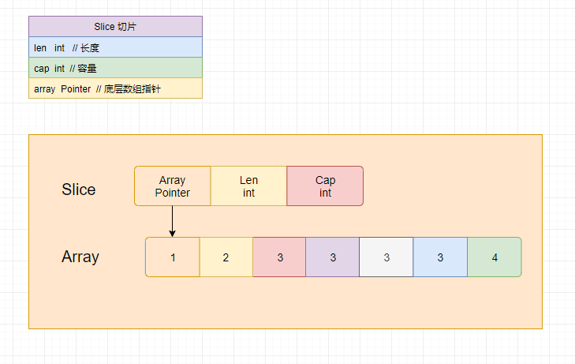
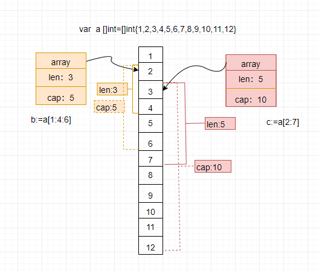

# 切片

## 基础

* 切片：是对数组的引用，其本身不包含数据，用于快速访问数组。
* 切片包含三个元素：长度、容量、底层数组指针。
* 结构体：切片本身是个结构，按值传递。
* 遍历：与数组相同
* 变长：切片长度可变，能自动扩容
* 可变：切片包含了底层数组的指针，因而可以通过该指针修改数组元素的值
* 不可比较：切片不可比较，仅能与nil比较：slice==nil
* 一对多：一个数组可以对应多个slice

### 定义切片

```go 
package main

import "fmt"

func main() {

	//1、声明切片
	// 空切片：未指定长度的slice是空切片，值为：nil
	var s1 []int
	if s1 == nil {
		fmt.Println("s1：nil")
	} else {
		fmt.Println("s1：not nil")
	}

	// 2、简短声明 :=
	s2 := []int{}
	fmt.Println("s2：", s2)

	// 3、make()函数，最常用方式
	var s3 []int = make([]int, 0)
	if s3 == nil {
		fmt.Println("s3：nil")
	} else {
		fmt.Println("s3：not nil")
	}
	fmt.Println("s3：", s3)

	// 4、初始化赋值
	var s4 []int = make([]int, 0, 0)
	fmt.Println("s4：", s4)
	s5 := []int{1, 2, 3}
	fmt.Println("s5：", s5)

	// 5、从数组切片
	arr := [10]int{1, 2, 3, 4, 5, 6, 7, 8, 9, 10}
	var s6 []int
	s6 = arr[1:5]     // 左闭右开
	s7 := arr[3:9:10] // 指定cap
	fmt.Println("s6：", s6)
	fmt.Println("s7：", s7, len(s7), cap(s7))
}
```

输出：
```bash
s1：nil
s2： []
s3：not nil
s3： []
s4： []
s5： [1 2 3]
s6： [2 3 4 5]
s7： [4 5 6 7 8 9] 6 7
```

!> s1和s3的声明：s3是通过make函数创建的切片，它不为nil,因为make创建了一个空切片，其底层数组为nil,但是切片的底层数组指针不是nil

切片操作符：

|操作符|说明|
|-----|--------|
|s[n]|获取索引为`n`的元素|
|s[:]|获取所有元素|
|s[:n]|获取从开始到索引`n`的元素，不包含`n`|
|s[n:]|获取从n到结束的所有元素，包含`n`|
|s[m:n]|获取索引`m`到`n`的所有元素，包含m,不包含`n`|
|s[m : n : max]|获取索引`m`到`n`的所有元素，包含`m`,不包含`n`,最大索引为`max`，`cap=max-m,` ,`max` 必须大于等于 `n`，否则会引发编译错误|

!> 应尽量使用make函数创建切片，这样能避免了数组必须使用常量做长度的问题。make在创建切片时，同时创建了一个匿名数组，该数组只能通过这个切片访问。

!> 注意：切片和数组的字面量声明十分相似，但是切片没有指定长度，这是两者的区别。

### 常用操作
|函数|说明|
|-----|--------|
|append|追加元素，会在元素末尾添加元素，当容量不足以追加元素时，append会重新新建一个容量更大的底层数组，一般新的容量会增加双倍，然后将原数组的元素拷贝到新数组，再讲切片指针指向新的数组|
|len|获取切片长度|
|cap|获取切片容量|
|copy|复制切片元素。将源切片的元素，写入到目标切片的对应索引位置,即覆盖对应位置的数据|

```go
	s1 := []int{1, 2, 3, 4, 5}
	fmt.Printf("s1 : %v\n", s1)

	/*********将小切片拷贝到大切片*********/
	s2 := make([]int, 10)
	fmt.Printf("s2 : %v\n", s2)

	copy(s2, s1) // 将s1拷贝到s2
	fmt.Printf("copied s1 : %v\n", s1)
	fmt.Printf("copied s2 : %v\n", s2)

	/********将大切片拷贝到小切片**********/
	sq := make([]int, 2)
	fmt.Printf("sq : %v\n", sq)

	copy(sq, s1) 
	fmt.Printf("copied sq : %v\n", sq)

	/********覆盖数据**********/
	s3 := make([]int, 10, 12)
	s3[0] = 9
	s3[1] = 8
	s3[2] = 7
	fmt.Printf("s3 : %v\n", s3)

	copy(s3, s1)
	fmt.Printf("s3 copied: %v\n", s3)

	s3 = append(s3, s2...)
	fmt.Printf("appended s3 : %v\n", s3)

	s3 = append(s3, 4, 5, 6)
	fmt.Printf("last s3 : %v\n", s3)

```
输出：
``` bash
s1 : [1 2 3 4 5]
s2 : [0 0 0 0 0 0 0 0 0 0]
copied s1 : [1 2 3 4 5]
copied s2 : [1 2 3 4 5 0 0 0 0 0]
sq : [0 0]
copied sq : [1 2]
s3 : [9 8 7 0 0 0 0 0 0 0]
s3 copied: [1 2 3 4 5 0 0 0 0 0]
appended s3 : [1 2 3 4 5 0 0 0 0 0 1 2 3 4 5 0 0 0 0 0]
last s3 : [1 2 3 4 5 0 0 0 0 0 1 2 3 4 5 0 0 0 0 0 4 5 6]
```

## 数据结构

slice是对数组的一个连续片段的引用，其本身是一个结构体，包含三个属性，如下：
```go
type slice struct {
    array unsafe.Pointer // 底层数组指针
    len   int            // 切片长度   
    cap   int            // 切片容量
}
```


```go
func main() {
	var a []int = []int{1, 2, 3, 4, 5, 6, 7, 8, 9, 10, 11, 12}
	b := a[1:4:6]
	c := a[2:7]

	fmt.Printf("a : %v\n", a)
	fmt.Printf("b : %v\n", b)
	fmt.Printf("c : %v\n", c)
}
```
a、b、c的内存结构如下：


b、c都是从a创建的切片，都指向a。他们存在重复的区间。
!> 通过切片更改数组数据，那么所有指向该驻足的切片都会受到影响

```go
func main() {
	var a []int = []int{1, 2, 3, 4, 5, 6, 7, 8, 9, 10, 11, 12}
	b := a[1:4:6]
	c := a[2:7]

	fmt.Printf("a : %v\n", a)
	fmt.Printf("b : %v\n", b)
	fmt.Printf("c : %v\n", c)

	b[2] = 20

	fmt.Printf("a : %v\n", a)
	fmt.Printf("b : %v\n", b)
	fmt.Printf("c : %v\n", c)
}
```
输出：

``` Bash
	a : [1 2 3 4 5 6 7 8 9 10 11 12]
	b : [2 3 4]
	c : [3 4 5 6 7]
	a : [1 2 3 20 5 6 7 8 9 10 11 12]
	b : [2 3 20]
	c : [3 20 5 6 7]
```

